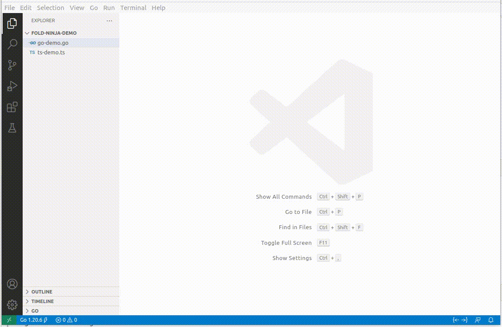

## Fold Ninja

Fold Ninja is an extension for Visual Studio Code, designed to boost code readability and efficiency in code reviews. With a spectrum of working modes - from Compact for a streamlined code review experience to Expanded for scenarios requiring an untouched code view, and an Intermediate mode offering customizable folding behavior - Fold Ninja adapts to your diverse coding needs. It also has a Inactive mode that temporarily disables the extension without the need to uninstall it.

The extension triggers folding or unfolding actions as you navigate between files, considering any changes since your last view. Specifically tailored algorithms support a wide range of languages, including C, C++, Go, Rust, JavaScript, TypeScript, Python, and C#.

## Features and Usage

### Working Modes

Fold Ninja offers four distinct working modes to suit various coding scenarios:

1. **Inactive `{X}`**: In this mode, Fold Ninja is entirely inactive, allowing the code to be displayed in its original form, without any alterations.

2. **Compact `{...}`**: Ideal for code reviews, this mode folds away comments and specific code blocks (like error handling in Go) for a cleaner, more focused view. For example, in Go files, non-critical error handling lines are folded to emphasize the main logic.

To illustrate, consider this block of Go code:

~~~go
file, err := os.Open("file.go") // For read access.
if err != nil {
	log.Fatal(err)
}
data := make([]byte, 100)
count, err := file.Read(data)
if err != nil {
	log.Fatal(err)
}
fmt.Printf("read %d bytes: %q\n", count, data[:count])
~~~

In Compact mode, Fold Ninja folds away error handling lines, resulting in the following view:

~~~go
file, err := os.Open("file.go") // For read access.
data := make([]byte, 100)
count, err := file.Read(data)
fmt.Printf("read %d bytes: %q\n", count, data[:count])
~~~

3. **Intermediate `{.|.}`**: A balance between the Compact and Expanded modes. Currently, this mode folds the first significant block of text in a file, typically a lengthy comment or license information. This feature is useful for immediately focusing on the primary content of the file.

4. **Expanded `{<- ->}`**: Unfolds all sections of your code, providing a complete view with all details visible.

Each mode is designed to enhance your coding experience by adapting to different needs, from detailed reviews to a broad overview of the code.

### Switching Between Working Modes

Switching between the working modes in Fold Ninja is designed to be straightforward and user-friendly. Here's how you can easily navigate through the different modes:

- **Access the Menu**: Simply click on the Fold Ninja icon located in the lower part of the editor. This icon displays the current working mode for easy identification.
- **Select a Mode**: The menu that appears upon clicking the icon will list the following options for you to choose from:
  - **Switch to Inactive Mode**: Deactivate Fold Ninja, reverting your code to its original, unaltered state.
  - **Switch to Compact Mode**: Activate the mode that compacts your code by folding comments and certain code blocks for a streamlined view.
  - **Switch to Intermediate Mode**: Opt for a balanced view that folds the first significant block in your file, such as extensive comments or license information.
  - **Switch to Expanded Mode**: Fully expand all sections of your code for a comprehensive view.
- **Execute Commands**: In addition to switching modes, you can directly execute commands like expand, compact, or intermediate for the current view from the same menu.

This intuitive interface ensures that you can efficiently manage your code's visibility with minimal disruption to your workflow.

## Configuration Options

To enhance Fold Ninja's performance and adaptability, the following configuration options are available:

1. **Maximum Number of Bytes for Folding Calculations**:
   - Setting: `fold-ninja.maxNumberOfBytes`
   - Default: 1,000,000 bytes
   - Purpose: Sets a file size limit for performing folding calculations in general scenarios. Files larger than this limit won't have folding calculations applied, optimizing performance for extensive codebases.

2. **Maximum Number of Bytes in Intense Mode**:
   - Setting: `fold-ninja.maxNumberOfBytesIntenseMode`
   - Default: 10,000 bytes
   - Purpose: Specifies the file size limit for real-time folding updates (Intense Mode). This limit is particularly useful when immediate updates to folding regions are necessary, such as during active code editing in smaller files.

These settings help manage the extension's performance by determining how it handles folding calculations based on file size, ensuring that Fold Ninja remains efficient and responsive to your coding needs.
## Demo video

## License

Fold Ninja is licensed under the MIT License. See the [LICENSE](./LICENSE) file for more details.
