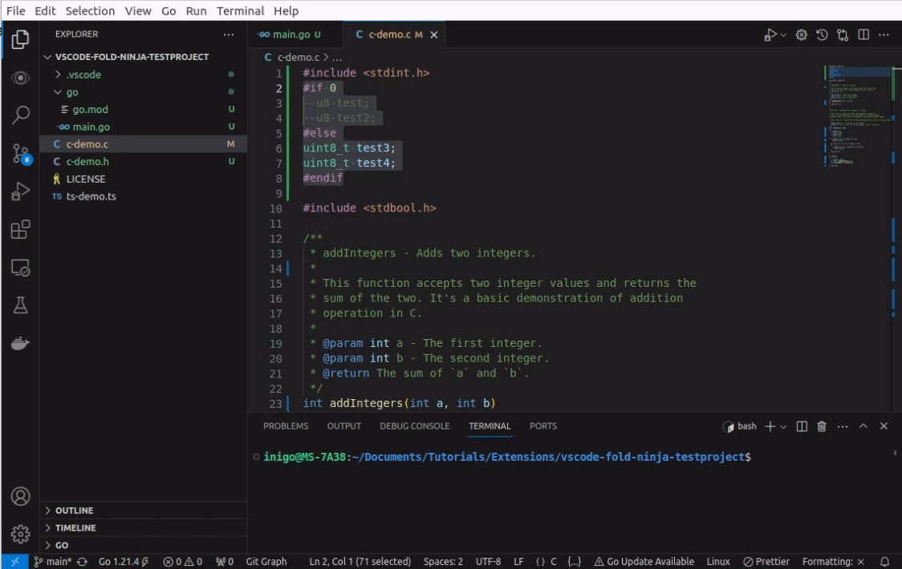

## Fold Ninja

Fold Ninja is a Visual Studio Code extension designed to enhance code readability and review efficiency. By allowing you to toggle between different folding states, it reduces the visual clutter in your code, making it easier to focus on the most important aspects.

The latest update introduces a more versatile way of controlling Fold Ninja's behavior, offering you a quick and intuitive way to switch between different folding states and functionalities.

## Features and Usage

### Menu Options for Enhanced Control

Fold Ninja now offers a menu with multiple options, providing you with more control over how you view your code:

1. **Collapse**: Instantly fold all sections of your code.
2. **Collapse first**: Instantly fold first folding section of your code.
3. **Expand**: Unfold all sections to view your entire codebase.
4. **Change Status to Collapsing**: Set Fold Ninja to automatically collapse certain sections (like comments or verbose error management in Go).
4. **Change Status to Collapsing first**: Set Fold Ninja to automatically collapse first foldable section.
5. **Change Status to Expanding**: Automatically expand all sections of your code.
6. **Change Status to Inactive**: Deactivate Fold Ninja to view your code in its original state.

Accessing these options is simple:

- Click on the Fold Ninja status bar item.
- Choose your desired action from the menu.

This update allows you to quickly switch between states without navigating through each status sequentially, enhancing your coding experience with more flexibility.

### Fold Ninja Statuses

Fold Ninja operates in three different statuses designed to enhance your code navigation and review experience:

**1. Inactive `{X}`**

In this status, Fold Ninja is completely dormant and inactive. It allows your code to be displayed in its full, original form. The experience is akin to not having the extension installed at all, preserving the unaltered view of your codebase.

**2. Compact `{...}`**

Compact mode is where the power of Fold Ninja truly shines. In this active state, the extension effortlessly folds away verbose parts of your code. This includes comments across any language and error management blocks in Go files, making it versatile for a range of coding environments. The outcome? A more streamlined, focused, and comprehensible view of your code, regardless of the language you're working in.

To illustrate, consider this block of Go code:

~~~go
file, err := os.Open("file.go") // For read access.
if err != nil {
	log.Fatal(err)
}
data := make([]byte, 100)
count, err := file.Read(data)
if err != nil {
	log.Fatal(err)
}
fmt.Printf("read %d bytes: %q\n", count, data[:count])
~~~

In Compact mode, Fold Ninja folds away error handling lines, resulting in the following view:

~~~go
file, err := os.Open("file.go") // For read access.
data := make([]byte, 100)
count, err := file.Read(data)
fmt.Printf("read %d bytes: %q\n", count, data[:count])
~~~

Here, Fold Ninja folds away the error handling code, resulting in a more compact code view that places the primary logic front and center. This enhances the clarity of your code, making it quicker to review and easier to understand.

**3. Expanded `{<- ->}`**

The Expanded status unfolds any previously compacted sections. All parts of your code, including comments and error handling routines, are visible in this state.

**4. Collapse First Block `{.1.}`**

This status in Fold Ninja, is designed to simplify your initial view of a file by automatically collapsing the first significant block of text. This feature is particularly useful for files that start with extensive comments or licensing information, enabling you to immediately focus on the core content of the file. When activated, Fold Ninja will identify and fold the initial block or comment, streamlining your workflow and decluttering the visible code area. This addition enhances the extension's usability, especially when dealing with files containing standard header comments or documentation blocks.

Currently this feature is implemented for c, c++, c#, go, rust, javascript, typescript and python. If you are interested in adding another language please open an issue with an example of a source file of a language and a small description of how comments and strings work in that language.

### Demo video

## License

Fold Ninja is licensed under the MIT License. See the [LICENSE](./LICENSE) file for more details.
